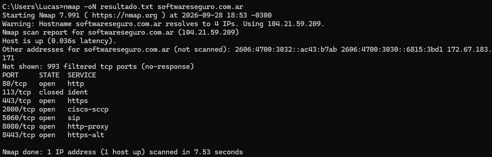

Host is up (0.036s latency).
Other addresses for softwareseguro.com.ar (not scanned): 2606:4700:3032::ac43:b7ab 2606:4700:3030::6815:3bd1 172.67.183.171
Not shown: 993 filtered tcp ports (no-response)
PORT     STATE  SERVICE
80/tcp   open   http
113/tcp  closed ident
443/tcp  open   https
2000/tcp open   cisco-sccp
5060/tcp open   sip
8080/tcp open   http-proxy
8443/tcp open   https-alt

# Nmap done at Mon Sep 28 18:53:25 2026 -- 1 IP address (1 host up) scanned in 7.53 seconds
```
Se identificaron los puertos 80 (HTTP) y 443 (HTTPS) abiertos. Despues, los puertos 8080 (HTTP-proxy) y 8443 (HTTPS-alt) también se encuentran expuestos.
Entiendo que con esta misma herramienta se puede obtener mucha mas informacion, pero por una cuestion de no ser tan ruidosos para los servidores de softwareSeguro opte por no continuar. 
```
